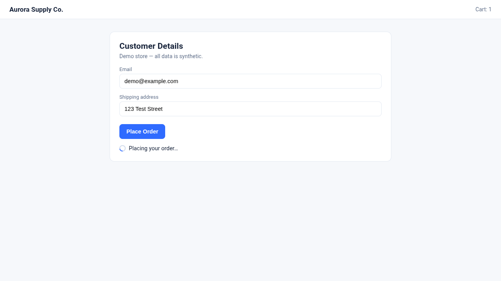
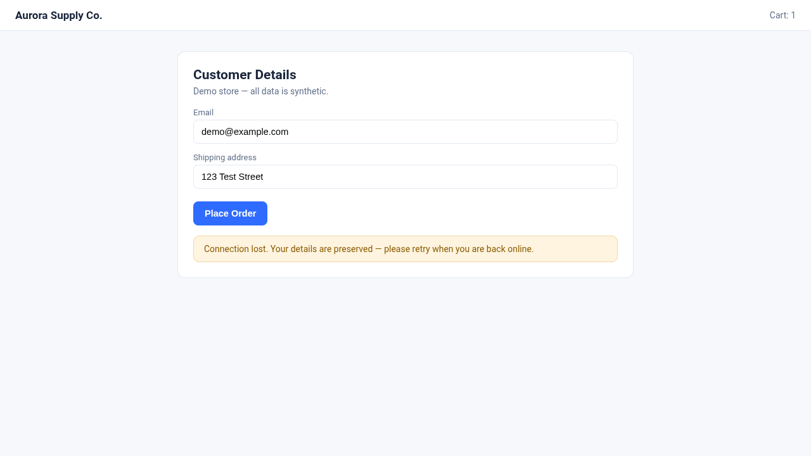

# ChaosLens

**See what your users see when your backend fails.**

ChaosLens is a Solari-powered browser reliability auditor. It runs your application
in a real Solari Sandbox, drives a critical user flow in a real Solari Browser,
deliberately breaks the backend (HTTP 500, slow responses, offline), and turns
what the user actually experiences into deterministic, evidence-backed verdicts.



*Real acceptance evidence — HTTP 500 scenario: the injected 500 is ignored by
the app, the spinner keeps spinning, no error is shown. Verdict: FAIL.*



*Real acceptance evidence — Offline scenario: connection lost, the app shows an
offline banner and preserves the entered details. Verdict: PASS.*

The full HTML report lives at `artifacts/<run-id>/report.html`.

```text
Baseline      PASS

HTTP 500      FAIL   spinner never terminates, no error shown
Slow API      FAIL   duplicate checkout requests submitted
Offline       PASS   graceful offline banner, form state preserved

Reliability Score: 33/100
```

> Core demonstration results come from real Solari sessions. No mocked Solari
> execution is used for published evidence.

---

## Why

Happy-path testing is mature. Failure-path experience is not.

Production users routinely meet states that tests rarely cover: the API returns
500, the API takes eight seconds, the network disappears. Applications that
"work" in these states still frequently present them badly — an infinite
spinner, a duplicate submission, a dead button, a blank page, a silently lost
action.

ChaosLens audits exactly this layer: **user-visible reliability**. It answers:

> When the system underneath the UI fails, does the application fail gracefully
> for the human using it?

## Why Solari

The audit needs two things that are hard to get locally at the same time:

1. **A controlled system environment** — Solari Sandbox boots a Linux microVM,
   clones the target repository, installs and runs it, exposes a public preview
   URL, and supports snapshot/revert so every scenario starts from the same
   proven-healthy state.
2. **A controlled human experience** — Solari Browser is a real cloud Chrome
   with Playwright-compatible automation and built-in session recording, so the
   exact user experience is replayable evidence.

ChaosLens connects the two: the Sandbox creates the controlled system
environment, the Browser creates the controlled human experience, and ChaosLens
turns the failure behavior into evidence.

## How it works

```text
              ChaosLens
                  │
                  ▼
          ┌──────────────┐
          │Solari Sandbox│  clone → install → start → health
          │  snapshot ───┼──────────────────────────┐
          └──────┬───────┘                          │
            Preview URL                             │ revert + re-health
                  ▼                                 │ between scenarios
          ┌──────────────┐                          │
          │Solari Browser│  execute flow ◄──────────┘
          │ inject fault │  (fresh recorded session per run)
          │   record     │
          └──────┬───────┘
                 ▼
        ┌─────────────────┐
        │Evidence & Verdict│  screenshot, replay, network,
        │                  │  console, fault events, server log
        └────────┬─────────┘
                 ▼
        Reliability Report (HTML)
```

Per audit:

1. Create a Sandbox, clone the configured public repository, install + start it.
2. Resolve the preview URL and wait until the app is healthy.
3. Snapshot the healthy state.
4. Run the **baseline** (no fault). If it fails, the audit is `BLOCKED` — no
   resilience claims are made about an already-broken application.
5. For each chaos scenario: revert to the snapshot, re-fetch the preview URL,
   re-verify health, then run the same flow in a fresh recorded browser session
   with the fault armed.
6. Evaluate deterministic assertions, persist the evidence bundle, release the
   browser, poll for the replay, and only then move to the next scenario.
7. Generate `report.html`, release every browser session, kill the Sandbox.

Verdicts are strict (per scenario):

- `PASS` — the fault provably fired and every resilience assertion passed.
- `FAIL` — the fault provably fired and an application assertion failed.
- `ERROR` — harness/infrastructure problem (bad selector, fault never armed,
  sandbox/browser failure). Infrastructure problems are **never** reported as
  application FAILs.

Score = `PASS / (PASS + FAIL) × 100` over chaos scenarios. Any `ERROR` (or
missing replay evidence) makes the audit `INCONCLUSIVE` instead of scoring.

## Faults

Exactly three fault classes:

| Fault | Mechanism | Proof of activation |
| --- | --- | --- |
| HTTP 500 | Playwright-compatible route interception fulfills the target with a controlled 500 | every intercept recorded in `fault-events.json` |
| Latency | route interception delays the request by a configured deterministic amount | per-request delay records with timestamps |
| Offline | BrowserContext switched offline immediately before the critical action | activation event + failed-request evidence |

If a configured fault never fires, the scenario is `ERROR`, never `PASS`.

## Quickstart

```bash
cd examples/chaoslens
npm install

# provide your Solari key (console.getsolari.com)
export SOLARI_API_KEY=slr_live_...      # or copy .env.example to .env

# point the config at a public repo containing the audited app, then:
npm run audit -- --config ./chaoslens.config.example.ts
```

The terminal stays concise; full evidence lands in `artifacts/<run-id>/`:

```text
ChaosLens

✓ Solari Sandbox created
✓ Repository cloned
✓ Dependencies installed
✓ Application ready
✓ Baseline passed

Reliability scenarios

✗ HTTP 500
✗ Slow API
✓ Offline

Reliability Score: 33 / 100

Report:
artifacts/<run-id>/report.html
```

Flags: `--output <dir>`, `--verbose`.

## Configuration

`chaoslens.config.ts` is an explicit contract — V1 performs **no framework
auto-detection**:

```ts
{
  application: {
    name, repository: { url, ref },
    installCommand, startCommand, cwd,
    port, healthPath, healthTimeoutMs
  },
  flow: {
    name,
    steps: [goto | click | fill | waitForVisible | waitForHidden | wait],
    faultArmBeforeStep,   // arm the active fault right before this step
    timeoutMs
  },
  scenarios: [
    { id, name, fault: null, assertions: [...] },        // baseline
    { id, name, fault: { type, target, delayMs }, assertions: [...] }
  ]
}
```

Assertions: `visible`, `hidden`, `disabled`, `requestCount`, `text`,
`baselineSuccess`. Configs are runtime-validated and fail fast.

## Evidence

Every scenario persists (all secrets redacted):

```text
scenario-result.json   verdicts, assertions, fault activation
screenshot.png         what the user saw
browser-console.log    console events with timestamps
network-events.json    timestamp / method / url / status / duration
fault-events.json      when ChaosLens injected what
server.log             application stdout/stderr
replay-url.txt         Solari session replay reference (+ replay.ndjson raw)
```

## Demo

The bundled `demo/checkout-app` is a zero-dependency checkout engineered with a
realistic resilience profile so the audit demonstrates all four outcomes
deterministically:

- Healthy → **PASS**
- HTTP 500 → **FAIL**: the 500 response is ignored; the spinner never stops and
  no error is shown.
- Slow API (8s) → **FAIL**: the Place Order button is never disabled while
  pending, so the deterministic second programmatic click submits a duplicate.
- Offline → **PASS**: fetch rejects, the app shows an offline banner and
  preserves the form.

All demo form data is synthetic (`demo@example.com`, `123 Test Street`).

## Limitations (V1, frozen)

- Public Git repositories, Node.js targets, explicit configuration only.
- One sandbox, sequential scenarios, one fresh browser session per run.
- Replay URLs may expire; the downloaded raw replay is the durable artifact.
- No runtime LLM anywhere in the verdict path — determinism over autonomy.

## Development methodology

```text
Frozen Spec (docs/CHAOSLENS_SPEC_V1.1.md)
  → AI-assisted implementation
  → Independent AI code review
  → Real-environment validation (Phase 0 smoke gate + acceptance run)
  → Public evidence
```

AI-assisted development is explicit and intentional; the frozen Spec, the
implementation plan (`docs/CHAOSLENS_PLAN.md`), and the implementation report
(`docs/CHAOSLENS_IMPLEMENTATION_REPORT.md`) are all committed.
